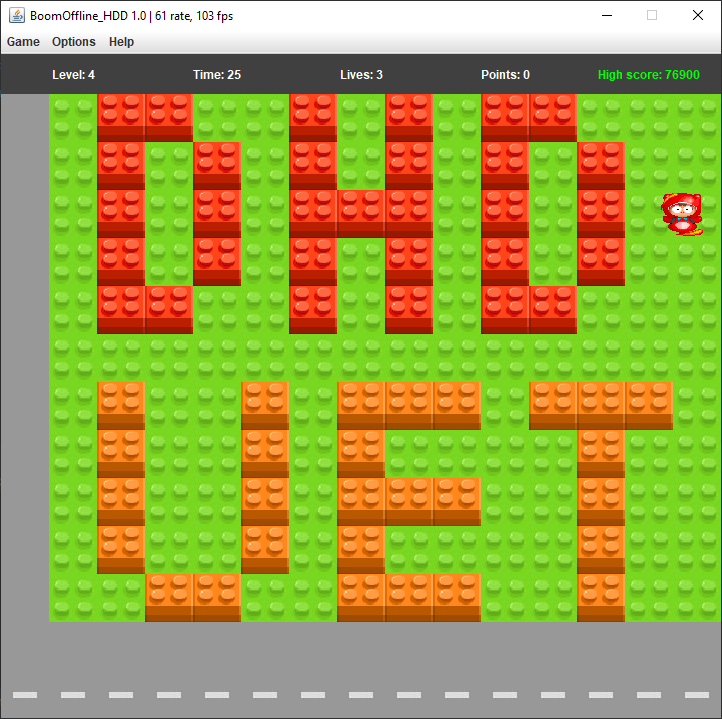

# Java_BoomOffline

> 
> Trường Đại học Công nghệ - Đại học Quốc gia Hà Nội.
> 
> OOP - Lập trình hướng đối tượng
> 
> Thực hiện:
> 
> **1. Hà Văn Quốc Dũng - 20020378**
>
> <https://github.com/Dung24-6>
>  
> **2. Lê Huy Hoàng - 20020409**
> 
> <https://github.com/ktshglsm>
> 
> **3. Trương Minh Đức - 2002396**
> 
> <https://github.com/minhduc-mll>
> 
> Cập nhật lần cuối: **10/12/2021**
>
## *Lấy project làm ơn ghi nguồn dùm 😄😄😄*

---
### Mô tả
Bài tập lớn 2 môn lập trình hướng đối tượng: 
Xây dựng và phát triển game bomberman bằng Java.

Gồm có các thư mục:
* res -> Thư mục tài nguyên.
* src -> Thư mục mã nguồn.

---

### Mô tả về các đối tượng trong trò chơi:

Bomber là nhân vật chính của trò chơi. Bomber có thể di chuyển theo 4 hướng trái/phải/lên/xuống theo sự điều khiển của người chơi.

Enemy là các đối tượng mà Bomber phải tiêu diệt hết để có thể qua Level. Enemy có thể di chuyển ngẫu nhiên hoặc tự đuổi theo Bomber tùy theo loại Enemy. Các loại Enemy sẽ được mô tả cụ thể ở phần dưới.

Bomb là đối tượng mà Bomber sẽ đặt và kích hoạt tại các ô Grass. Khi đã được kích hoạt, Bomber và Enemy không thể di chuyển vào vị trí Bomb. Tuy nhiên ngay khi Bomber vừa đặt và kích hoạt Bomb tại ví trí của mình, Bomber có một lần được đi từ vị trí đặt Bomb ra vị trí bên cạnh. Sau khi kích hoạt 2s, Bomb sẽ tự nổ, các đối tượng Flame được tạo ra.

Grass là đối tượng mà Bomber và Enemy có thể di chuyển xuyên qua, và cho phép đặt Bomb lên vị trí của nó

Wall là đối tượng cố định, không thể phá hủy bằng Bomb cũng như không thể đặt Bomb lên được, Bomber và Enemy không thể di chuyển vào đối tượng này

Brick là đối tượng được đặt lên các ô Grass, không cho phép đặt Bomb lên nhưng có thể bị phá hủy bởi Bomb được đặt gần đó. Bomber và Enemy thông thường không thể di chuyển vào vị trí Brick khi nó chưa bị phá hủy.

Portal là đối tượng được giấu phía sau một đối tượng Brick. Khi Brick đó bị phá hủy, Portal sẽ hiện ra và nếu tất cả Enemy đã bị tiêu diệt thì người chơi có thể qua Level khác bằng cách di chuyển vào vị trí của Portal.

Các Item cũng được giấu phía sau Brick và chỉ hiện ra khi Brick bị phá hủy. Bomber có thể sử dụng Item bằng cách di chuyển vào vị trí của Item. Thông tin về chức năng của các Item được liệt kê như dưới đây:
1. SpeedItem Khi sử dụng Item này, Bomber sẽ được tăng vận tốc di chuyển thêm một giá trị thích hợp
2. FlameItem Item này giúp tăng phạm vi ảnh hưởng của Bomb khi nổ (độ dài các Flame lớn hơn)
3. BombItem Thông thường, nếu không có đối tượng Bomb nào đang trong trạng thái kích hoạt, Bomber sẽ được đặt và kích hoạt duy nhất một đối tượng Bomb. Item này giúp tăng số lượng Bomb có thể đặt thêm một.
4. NewBoomItem : Sau khi ăn item này , boom của bạn sẽ đổi màu .
5. ItemCoin : Ăn Item này để tăng điểm . 

Các loại enemy : 
1. Baby : là Enemy đơn giản nhất, di chuyển ngẫu nhiên với vận tốc cố định
2. Ghost : Tìm đường đi bằng cách đi ngang , đi dọc .  Có khả năng né bom .
3. Mummy : Tìm đường đi bằng cách đi ngang , đi dọc . Không có khả năng né bom .
4. Octopus : Tìm đường đi bằng cách đi ngang , đi dọc .  Có khả năng né bom . 
5. Pirate : Là enemy thông minh nhất , sử dụng thuật toán bfs để tìm đường đi ngắn nhất đến bomber .

Mô tả game play, xử lý va chạm và xử lý bom nổ
1. Trong một màn chơi, Bomber sẽ được người chơi di chuyển, đặt và kích hoạt Bomb với mục tiêu chính là tiêu diệt tất cả Enemy và tìm ra vị trí Portal để có thể qua màn mới.
2. Bomber sẽ bị giết khi va chạm với Enemy hoặc thuộc phạm vi Bomb nổ. Lúc đấy trò chơi kết thúc.
3. Enemy bị tiêu diệt khi thuộc phạm vi Bomb nổ.
4. Một đối tượng thuộc phạm vi Bomb nổ có nghĩa là đối tượng đó va chạm với một trong các tia lửa được tạo ra tại thời điểm một đối tượng Bomb nổ.
5. Khi Bomb nổ, một Flame trung tâm tại vị trí Bomb nổ và bốn Flame tại bốn vị trí ô đơn vị xung quanh vị trí của Bomb xuất hiện theo bốn hướng trên /dưới/trái/phải. Độ dài bốn Flame xung quanh mặc định là 1 đơn vị, được tăng lên khi Bomber sử dụng các FlameItem.
6. Khi các Flame xuất hiện, nếu có một đối tượng thuộc loại Brick/Wall nằm trên vị trí một trong các Flame thì độ dài Flame đó sẽ được giảm đi để sao cho Flame chỉ xuất hiện đến vị trí đối tượng Brick/Wall theo hướng xuất hiện. Lúc đó chỉ có đối tượng Brick/Wall bị ảnh hưởng bởi Flame, các đối tượng tiếp theo không bị ảnh hưởng. Còn nếu vật cản Flame là một đối tượng Bomb khác thì đối tượng Bomb đó cũng sẽ nổ ngay lập tức.

Các nâng cấp so với bomberman : 
- Nâng cấp thuật toán tìm đường đi cho enemy ( Dùng bfs ) .
- Thêm vào 4 enemy .
- Thêm vào 2 item coin và newboom .
- Thêm âm thanh .
- Đã xử lí đồ họa .
- Tạo thêm các map .
- Tạo các giao diện New Game .
 

